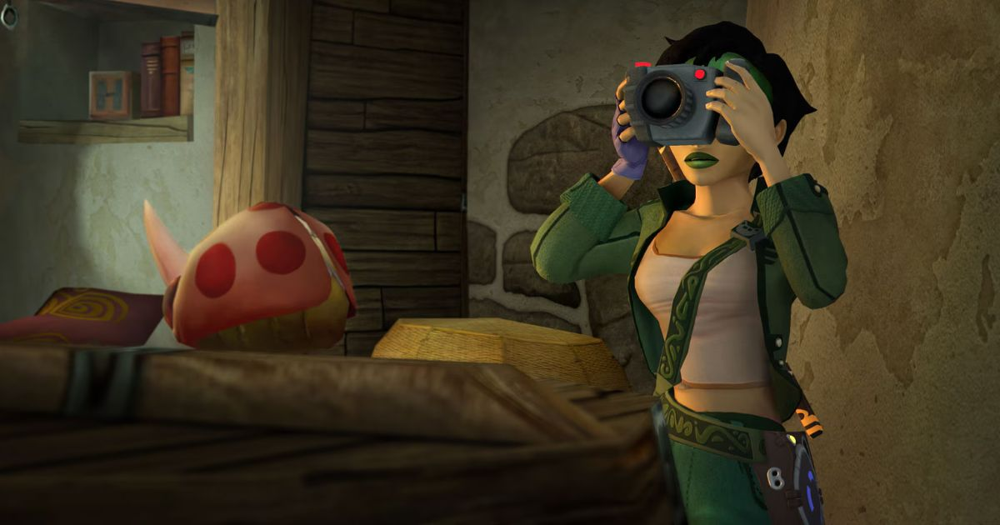
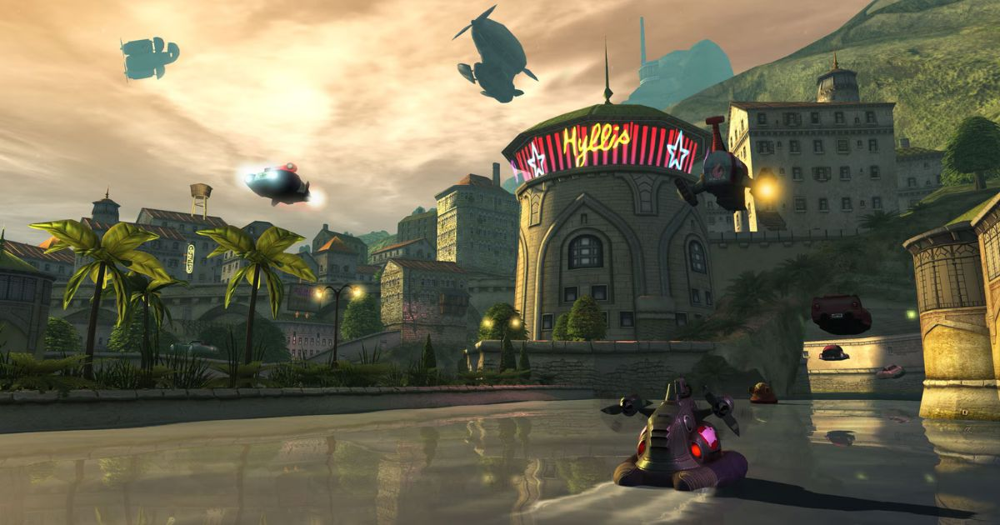

+++
title = 'A carismática e eclética trilha sonora de Beyond Good and Evil'
date = "2025-05-15"
lastmod = "2025-05-15"
author = "Breno Santana"
description = "Uma viagem nostálgica pela carismática e eclética trilha sonora de Beyond Good and Evil. Uma homenagem às geniais composições de Christophe Héral que marcaram minha infância."
url = "/a-carismatica-e-ecletica-trilha-sonora-de-beyond-good-and-evil/"
tags = ["Música", "Games", "Beyond Good and Evil", "Trilha Sonora", "Nostalgia"]
image = "/images/thumbnails/jade_com_camera.jpg"
+++

Eu passei toda a minha infância jogando videogame ao lado da minha irmã mais velha, e Beyond Good and Evil, clássico da Ubisoft lançado em 2003, foi um dos maiores marcos da nossa infância.

Mais do que especial por ser um dos nossos primeiros encontros com uma narrativa rica e emocionante, que nos fez enxergar a experiência com o videogame como algo ainda mais profundo e complexo — uma forma de arte capaz de despertar sentimentos intensos e transmitir lições valiosas.

Ao lado da protagonista Jade e seus companheiros, embarcamos em uma aventura épica em busca de um propósito nobre e transformador.

Cada segundo dessa jornada é acompanhado por uma trilha sonora impecável, que capta com perfeição a atmosfera caótica do universo do jogo e, ao mesmo tempo, nos conforta com uma centelha de esperança e mudança.

Quero destacar minhas cinco faixas favoritas da genial obra de Christophe Héral e homenageá-lo por ter me apresentado à complexidade emocional da música desde cedo.

### 1. "Mammago Garage"

Na minha opinião, é simplesmente o melhor reggae alternativo já criado. A ambientação é carismática, a letra é icônica e revela com clareza o quanto o universo do jogo é imersivo. Hal, Bakubar e Issam — a família de rinocerontes jamaicanos e rastafáris que comandam a Mammago's Garage são personagens absolutamente inesquecíveis.

### 2. "Salud Juanito"

Essa faixa foi o prelúdio da minha paixão pela música latina. Uma canção eletrizante, marcante e cheia de adrenalina. A trilha sonora perfeita para as corridas clandestinas de Hillys, que ganham um ritmo ainda mais vibrante e divertido.

### 3. "Ming's Melody"

Enquanto *Salud Juanito* me empolgou com a vibração contagiante da música latina, *Ming's Melody* hipnotizou minha alma com uma calmaria zen delicada e meditativa. Foi, provavelmente, meu primeiro contato com a sonoridade mística dos instrumentos tradicionais asiáticos.

### 4. "Slaughterhouse Scramble"

É claro que as corridas no matadouro de Hillys não poderiam ficar de fora. Esta faixa me deixou de boca aberta e olhos arregalados graças ao seu rock frenético — com energia crua e uma lírica gritante, scática e maluca. Eu não entendia absolutamente nada, mas dançava freneticamente.

### 5. "Akuda House Propaganda"

Poucas experiências se comparam a explorar o Akuda Bar: conversar com Mo, o carismático touro que administra o lugar; apostar partidas de shuffleboard contra o tubarão Francis; ou encarar o jogo dos cocos com Peepers. Ao fundo, um hip-hop improvisado e contagiante domina o ambiente, o retrato perfeito do clima underground do bar.

### Menção Honrosa: "Home Sweet Home"

É impossível não se apaixonar pela composição reflexiva que acompanha os créditos finais. As melodias tocantes e introspectivas nos fazem revisitar todos os desafios enfrentados e obstáculos vencidos, reforçando o valor da determinação e a importância de nunca desistir.

---

Sem dúvidas, 'eclética' é a palavra que melhor define a trilha sonora de Beyond Good and Evil.

A escolha foi difícil, pois todas as faixas são surpreendentes e contribuem igualmente para a grandiosidade desta obra. Sempre que revisito este clássico, sinto uma nostalgia profunda e um orgulho enorme por ter vivenciado essa experiência.

Um imenso obrigado ao Christophe Héral por compor esta obra-prima, e à minha querida irmã, por ter vivido tudo isso meu lado.